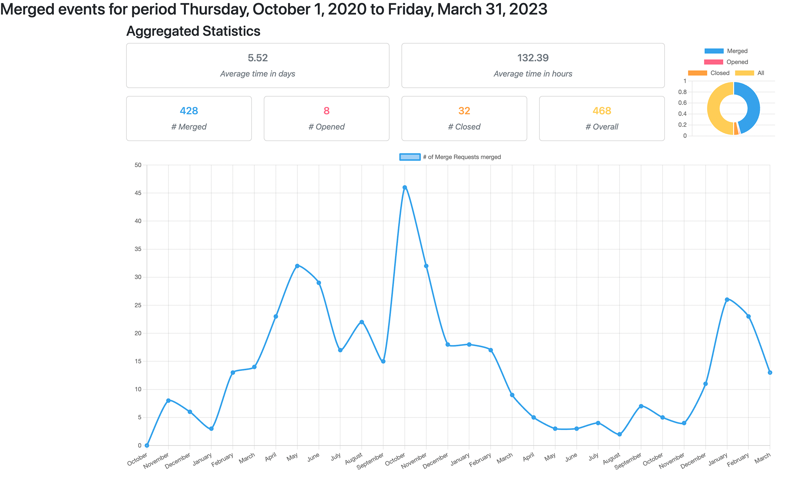

# Gitlab stats

Provide statistics usage of your gitlab projects

## Setup
**Prerequisites**
- Node v18.15

**Installation**
- Run `npm run build` will build the module in `./dist` 

## Usage
- `npm dist/index.js --help` will print:
  ```shell
  Usage: index [options] [command]
  
  Options:
  -h, --help                                 display help for command
  
  Commands:
  mr [options] <token> <projectId> <period>  Provide merge requests statistics for a given period
  help [command]                             display help for command
  ```
- `node dist/index.js mr <TOKEN> <PROJECT_ID> <PERIOD>` (<PERIOD> in the following format `2023-01-01,2023-01-31`) will print:
  ```json
  {
    "average": {
      "days": 3.79,
      "hours": 90.84
  },
    "total": {
      "merged": 58,
      "closed": 14,
      "opened": 6,
      "all": 78
    }
  }
  ```
- ` node dist/index.js mr <TOKEN> <PROJECT_ID> <PERIOD> --format html` (<PERIOD> in the following format `2023-01-01,2023-01-31`) will generate an `index.html` in the root project that will automatically open after generation.
  