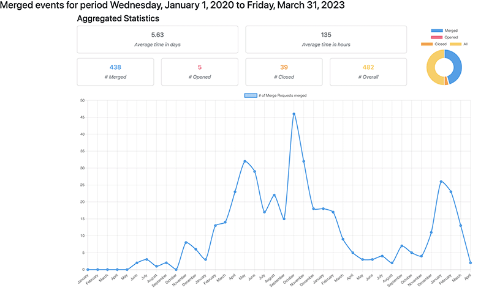

# Git stats

Provide MR/PR statistics for your Gitlab/GitHub projects

## Install

Run `npm install -g gitflows-stats`

## Usage

- `gitflows-stats --help` will print:

  ```shell
  Usage: index [options] [command]

  Options:
  -h, --help                                        display help for command

  Commands:
  gitlab [options] <token> <projectId> <period>     Provide merge requests statistics on a Gitlab project for a given period
  github [options] <token> <owner> <repo> <period>  Provide pull requests statistics on a GitHub project for a given period
  help [command]                                    display help for command
  ```

- `gitflows-stats gitlab <TOKEN> <PROJECT_ID> <PERIOD>` (<PERIOD> in the following format `2023-01-01,2023-01-31`) will print:
  ```json
  {
    "average": {
      "months": 0,
      "days": 4,
      "hours": 22,
      "minutes": 48,
      "seconds": 0
    },
    "total": {
      "merged": 15,
      "closed": 2,
      "opened": 3,
      "all": 20
    },
    "data": [
      [
        2023,
        [
          {
            "Week 9": 1
          },
          {
            "Week 10": 5
          },
          {
            "Week 11": 3
          },
          {
            "Week 12": 2
          },
          {
            "Week 13": 2
          },
          {
            "Week 14": 2
          }
        ]
      ]
    ]
  }
  ```
- `gitflows-stats gitlab <TOKEN> <PROJECT_ID> <PERIOD> --format html` (<PERIOD> in the following format `2023-01-01,2023-01-31`) will generate a `report` folder with an `index.html` where the command has been executed.

  **The report will automatically open after generation.**

  **example:**
  

### Available output format

- **Console (Default):** print a lightweight statistics in JSON into the console
- **HTML:** generates a `HTML` file, opening automatically in your browser
- **CSV:** generates a `CSV` file with all raws data
